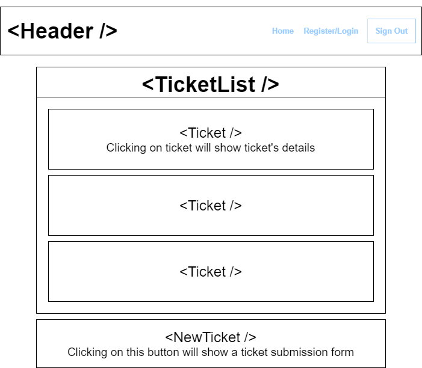
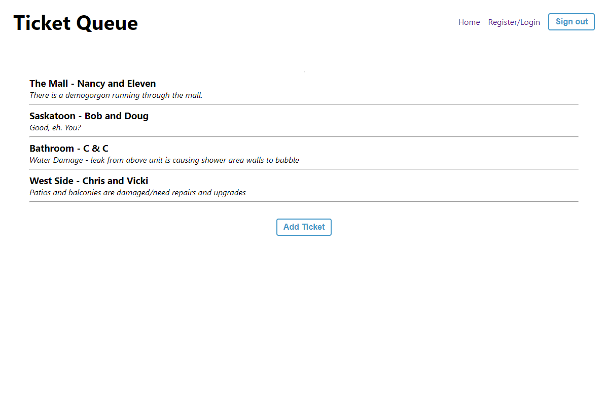

# Issue Tracker Help Queue - :sparkles: Simple CRUD App :sparkles:

This Help Queue application is as a study on CRUD operations. After login, users can view, edit and delete current 'active' tickets in the queue, as well as create new tickets.

[Demo](https://redux-issue-queue.web.app/ "Demo Site")

## Tech Stack

  1.  React - Frontend
  2.  Redux - State Management
  3.  React-redux-firebase and redux-firestore - Bindings
  4.  Firebase - Backend with:
          - Firestore Database
          - Firebase Authentication

## Application Structure Plan

### Components
The `<Header />` will remain the same regardless of whether the user is looking at all tickets, a specific ticket or the create new ticket form.

`<TicketList />` will loop through all tickets to display them on the page

`<Ticket />` will show individual ticket details and provide the user with the option to edit or close the ticket.

`<NewTicket />` will have a button that opens up to an add ticket form onClick.

## Application Snapshot

